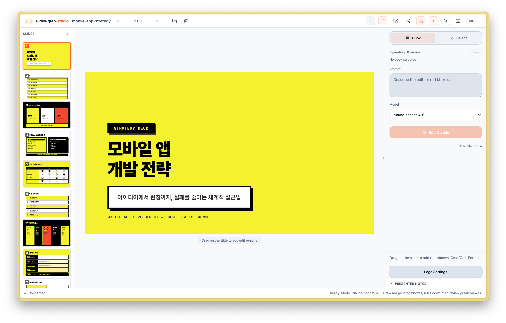

# Slide-Grab-Studio

**The Ultimate HTML-based Hybrid Slide Studio Maximizing Human-AI Collaboration**

Slide-Grab-Studio is a powerful, hybrid slide editor designed to work seamlessly with AI coding agents (like Claude Code). It provides the most intuitive environment to plan, generate, and edit slides. Handle simple text edits manually, and delegate complex layout changes or new element generation to the AI with a single mouse drag.



## Why Slide-Grab-Studio?

Describing specific layout changes to an AI using only text prompts is highly inefficient and error-prone. This project solves that bottleneck through a **Bbox Selection (Visual Context)** and an **Outline-First Workflow**. By providing exact visual and structural context to the AI, it eliminates the risk of touching the wrong code and drastically accelerates the presentation creation process.

---

## Key Features

### 1. Multi-Source Import & PDF Vision Pipeline

* **Rich Inputs:** Import content from multiple sources simultaneously — raw text, Markdown, URLs (scraped via `cheerio`), and PDFs (up to **5 files, 10 MB total** per request).
* **PDF Vision Analysis:** Goes beyond simple text extraction. Slide-Grab-Studio renders PDF pages to PNGs (`pdfjs-dist` + `@napi-rs/canvas`) and feeds them to the AI's vision model, ensuring charts, diagrams, and complex tables are fully understood. Vision rendering is capped at **25 pages per PDF** (configurable via `SLIDES_GRAB_PDF_PAGE_LIMIT` env var).
* **Smart Truncation:** If a document's extracted text exceeds 400 KB, it is automatically trimmed with a visible marker, preventing silent data loss.

### 2. Outline-First Workflow & Smart Review

* **Outline-First:** Before rendering any slides, the AI (Claude) generates a comprehensive `slide-outline.md` that preserves your original document's visual style hints (e.g., `- style: use dark background`). You review and edit this outline first, preventing wasted rendering time.
* **Rule-Based Review System:** A built-in review engine analyzes your deck's slide count (8–12 recommended), layout diversity (chart, table, timeline, metric, split, quote, image), and structure (cover/closing slide presence) to produce a score from **0–100** (grade A–F) with actionable suggestions.

### 3. Precision Bbox Selection (Modify & Create)

* **Drag-and-Drop Context:** Simply drag your mouse over any area you want to change. The editor captures the **XPath** and a **screenshot** of that bounding box, annotates it with numbered red-border overlays, and sends everything to the AI.
* **Crystal Clear Instructions:** The AI accurately **modifies** existing elements without breaking the layout, or perfectly **creates** new structures (e.g., "draw a skill matrix here") in the empty space you selected.

### 4. 38 Design Packs & 1-Click Retheme

* **AI Pack Recommendation:** Just type your topic, and the AI automatically recommends the most suitable design pack from the library.
* **Extensive Library:** Comes with **38 built-in design packs** ranging from `glassmorphism` and `cyberpunk-outline` to `nordic-minimalism` and `swiss-international`.
* **Design Spec System:** Each pack ships with a `design.md` spec (layout principles, CSS patterns, color system, typography rules). This spec is automatically injected into AI prompts during generation and retheme to enforce visual consistency.
* **Instant Retheme:** Completely transform the mood, colors, and typography of your entire deck with a single click.

### 5. Pro Workflow & Logo System

* **Global Logo Overlay:** Upload your logo once. It is automatically injected into editor views, PDF exports, and PPTX exports. Supports four corner position presets (`top-right`, `top-left`, `bottom-right`, `bottom-left`) with custom width, height, and per-slide exclude lists.
* **Deck Management (CRUD):** Manage multiple slide projects with built-in Rename, Duplicate (creates `-copy` suffix), and Delete from the deck browser. New decks are never silently overwritten — a `-2` suffix is added on name collisions.
* **Concurrency Safety:** An `AsyncMutex` on the server prevents multiple simultaneous AI generation or import jobs from corrupting state.

### 6. Multi-Format Export

**PDF:**
Export perfectly crisp, high-resolution PDFs with optional logo overlay.

**PPTX (two modes — choose in the export modal):**

| Mode | Output | Best For |
|---|---|---|
| **Image** *(default)* | Pixel-perfect screenshots embedded as images | Guaranteed visual fidelity |
| **Structured** | DOM extraction v3 → PptxGenJS editable text, shapes, and fonts | Post-export editing in PowerPoint |

The Structured mode uses a 3-tier fallback: DOM extraction → OpenAI GPT-4o vision (requires `OPENAI_API_KEY`) → screenshot embed if both fail.

**SVG / PNG Batch Export:**
Export all slides as SVG or PNG files, bundled into a single ZIP archive via Playwright + `dom-to-svg`.

**Figma:**
Connect the companion Figma plugin via WebSocket to activate the "Send to Figma" button in the editor. Once the plugin is connected, slides are transferred directly into your Figma file — the button is hidden by default until the plugin handshake is established.

### 7. Built-in Slide Validation

Run `slides-grab validate` before any export to catch layout and accessibility issues early:

```bash
slides-grab validate --slides-dir decks/<deck-name>
```

The validator checks each slide against 8+ rule categories:

| Category | Examples |
|---|---|
| **Frame overflow** | Elements outside the 720pt × 405pt boundary |
| **Text clipping** | Text taller than its container |
| **Layout** | Sibling element overlaps |
| **Contrast** | Text contrast ratio below WCAG thresholds (3:1 large / 4.5:1 normal) |
| **Assets** | Missing local image files, insecure HTTP image URLs |
| **Accessibility** | Missing `alt` text on images |

Six issue types are **export-blocking** and will prevent `convert` / `pptx` from proceeding until resolved.

---

## CLI Reference

```bash
# Core workflow
slides-grab edit   [--port] [--slides-dir]       # Open interactive editor
slides-grab create [--port] [--deck-name]         # Create a new deck
slides-grab import <source> [options]             # Import doc + auto-create deck
slides-grab browse [--port]                       # Deck browser UI

# Export
slides-grab validate --slides-dir <path>          # Validate before export (run this first)
slides-grab pdf     --slides-dir <path> [--output]
slides-grab convert --slides-dir <path> [--output]  # PPTX (image mode)
slides-grab svg     --slides-dir <path> [--output]

# Pack utilities
slides-grab list-packs
slides-grab show-pack <pack-id>
slides-grab show-theme <pack-id>

# Design tools
slides-grab retheme --deck <name> --pack <id>    # Non-interactive retheme
slides-grab split   --input <file>               # Split combined HTML to individual slides

# Logo management
slides-grab logo set    --slides-dir <path> --image <path> \
                        [--position top-right|top-left|bottom-right|bottom-left] \
                        [--width <in>] [--height <in>] [--exclude <slide-nums>]
slides-grab logo show   --slides-dir <path>
slides-grab logo remove --slides-dir <path>
```

---

## Installation & Setup

### Prerequisites

* Node.js v18 or higher

### Installation

```bash
# Clone the repository
git clone https://github.com/YooSuhwa/slides-grab.git
cd slides-grab

# Install dependencies
npm install

# Install Playwright browsers (required for export, validation, and rendering)
npx playwright install chromium

# Start the local development server
npm run dev
```

### Environment Variables

Create a `.env` file in the project root:

```bash
# Required — used for all AI generation (outline, slides, retheme, bbox edit)
ANTHROPIC_API_KEY=sk-ant-...

# Optional — required only for PPTX Structured mode AI fallback
OPENAI_API_KEY=sk-...

# Optional — limit PDF vision rendering (default: 25 pages)
SLIDES_GRAB_PDF_PAGE_LIMIT=10
```

---

## How to Use

1. **Import:** Feed your data (URL, PDF, text, or up to 5 mixed files) and let the AI recommend a design pack.
2. **Review Outline:** Check the AI-generated `slide-outline.md` and make manual adjustments if necessary.
3. **Validate:** Run `slides-grab validate` to catch overflow, contrast, or missing-asset issues before committing to export.
4. **Manual Edit:** Click directly on rendered text for quick typo fixes.
5. **AI Edit:** Use the **Bbox Selection** tool to drag over an area and ask the AI to redesign the layout or insert new elements.
6. **Retheme:** Hit the Retheme button in the navbar to apply a new pack across the entire deck.
7. **Export:** Export as Image PPTX (pixel-perfect), Structured PPTX (editable), PDF, or SVG/PNG batch.

---

## Acknowledgments

This project is an advanced fork of the [slides-grab](https://github.com/vkehfdl1/slides-grab) repository by vkehfdl1. The core foundation and initial inspiration for this workflow trace back to the `ppt_team_agent` built by Builder Josh. Huge thanks to them for their incredible groundwork!
